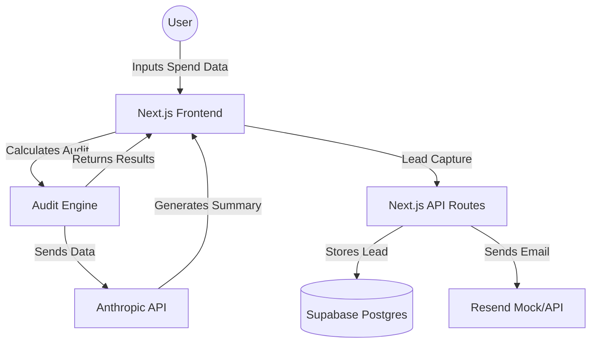

# Architecture

## System Diagram

## Data Flow
1. **Input:** User provides subscription details (tool, plan, seats, spend) via a dynamic React form.
2. **Audit Calculation:** The `auditEngine` utility compares input data against hardcoded, defensible pricing rules from `PRICING_DATA.md`.
3. **AI Enhancement:** Audit results are passed to the Anthropic API to generate a ~100-word personalized summary.
4. **Lead Capture:** User provides contact info to save the report; data is persisted in Supabase via Next.js Server Actions.
5. **Viral Loop:** A unique public URL is generated for the audit, utilizing Open Graph tags for social sharing.

## Why this stack?
- **Next.js:** Unified frontend and backend logic.
- **Supabase:** Instant Postgres API with built-in security, ideal for rapid prototyping.
- **Tailwind CSS:** Efficient styling for a "Product Hunt" level polish.

## Handling 10k Audits/Day
To scale to 10k audits/day:
- **Edge Functions:** Move the `auditEngine` to Vercel Edge Functions to reduce latency.
- **Caching:** Cache AI-generated summaries for identical tech stacks to minimize API costs.
- **Rate Limiting:** Implement strict rate limiting on API routes using Upstash or similar.
- **Queueing:** Use a background worker (e.g., Inngest) for email delivery to prevent blocking the main thread.
